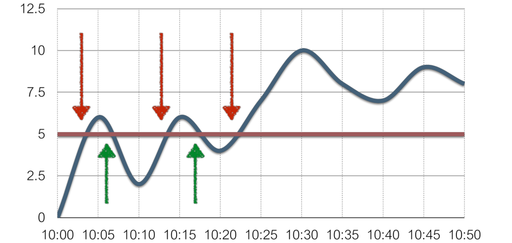
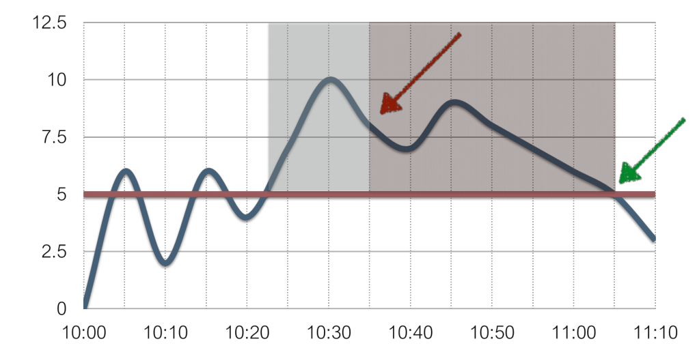
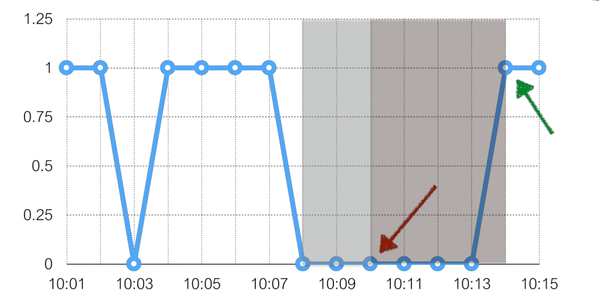
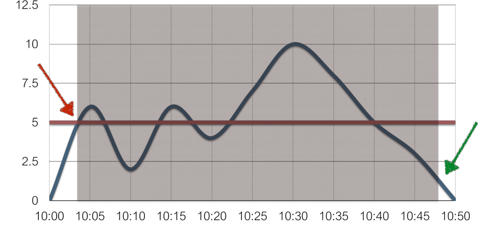

# Как изменить триггеры, чтобы было меньше срабатываний


* Операторы: `- + / * < > = <> >= <= not or and`

* Функции: `min max avg last count date time diff regexp` и многие другие!

* Анализируйте все: любую метрику с любого устройства:
```
{node1:system.cpu.load.last()} > 5 and {node2:system.cpu.load.last()} > 5 and
{nodes:tps.last()} < 5000
```

Пример: `{server:system.cpu.load.last()} > 5`



Возможны лишние сообщения о восстановлении сервиса и критичности работы сервиса, если значение ставноится то больше, то меньше критического.

Еще пример: `{server:net.tcp.service[http].last()} = 0`


<b>Чрезмерная чуствительность ведет к ложным срабатываниям!</b>

Решены ли эти проблемы?
```
Проблема: free disk space < 10%
Нет проблемы: free disk space = 10.001%
```
```
Проблема: CPU load > 5
Нет проблемы: CPU load = 4.99
```
```
Проблема: SSH check failed
Нет проблемы: SSH is up
```

Используйте данные из истории:

Производительность: {server:system.cpu.load.min(10m)} > 5

Доступность:
```
{server:net.tcp.service[http].max(5m)} = 0
{server:net.tcp.service[http].max(#3)} = 0
```

На графике показан момент, когда триггер сработает при условии `{server:system.cpu.load.min(10m)} > 5`:



Доступность http-сервиса: `{server:net.tcp.service[http].max(#3)} = 0`



Ранее: `{server:system.cpu.load.last()} > 5`

Теперь: 
```
Выражение проблемы: {server:system.cpu.load.last()}>5
Выражение восстановления: {server:system.cpu.load.last()}<=1
```

Получим всего 2 уведомления!



# Примеры:

## Система перегружена

Выражение проблемы: `{server:system.cpu.load.min(5m)}>3`

Выражение восстановления: `{server:system.cpu.load.max(2m)}<=1`

## Нет свободного места на /
Выражение проблемы: `{server:vfs.fs.size[/,pfree].last()}<10`

Выражение восстановления: `{server:vfs.fs.size[/,pfree].max(15m)}>30`

## SSH недоступен

Выражение проблемы: `{server:net.tcp.service[ssh].max(#3)}=0`

Выражение восстановления: `{server:net.tcp.service[ssh].min(#10)}=1`

